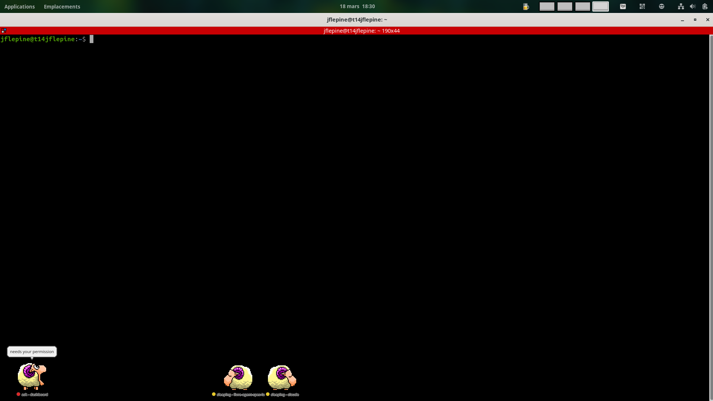

# Claaaude 🐑

> Desktop sheep for your Claude Code sessions.

I've been fascinated by eSheep since Windows 3.1. A tiny sheep wandering across your screen while you work. Pointless, charming, impossible not to love. When I started using Claude Code on Linux and realized there was basically nothing in terms of visual companions or desktop integrations, I knew I had to bring the sheep back.

So here we are. Each Claude Code session gets its own animated sheep, walking across the bottom of your screen, showing what Claude is up to.



## What it shows

Each sheep displays the current session state in real time:

- **idle**: Claude is waiting
- **working**: Claude is running a task
- **ask**: Claude needs your attention (speech bubble)
- **done**: task finished

The sheep also shows the working directory name, so you can tell your sessions apart at a glance.

## How it works

Claude Code hooks write session state to `$XDG_RUNTIME_DIR/claude_mascot_states/<PID>` (falls back to `/tmp`). The mascot polls those files and spawns one sheep per active session.

## Platform support

**Linux only**: X11 or XWayland (Ubuntu, Fedora, Arch, etc.).

Wayland-native and macOS/Windows aren't supported. The mascot relies on PyQt5 with X11, `wmctrl`, and `/proc` for process inspection.

> If you're on macOS or Windows and want something similar, open an issue. I'm curious whether there's interest.

## Install

```bash
sudo apt install python3-pyqt5 wmctrl
python3 install.py
```

The installer:
1. Registers hooks in `~/.claude/settings.json` so Claude Code reports its state
2. Creates a `.desktop` entry in `~/.config/autostart/` so the mascot launches on login

To start immediately without logging out:

```bash
python3 claude_mascot.py &
```

## Uninstall

```bash
python3 install.py --remove
```

Removes both the Claude Code hooks and the autostart entry. No traces left.

## License & attribution

The **Python code** (`claude_mascot.py`, `install.py`) is released under the [MIT License](LICENSE).

The **sprite assets** (BMP files, WAV sounds, icon, cursor) in `assets/` are not covered by the MIT license. They are included for educational and preservation purposes only.

### Original work

This project is a tribute to **eSheep** (Desktop Sheep), a Windows 3.1 desktop pet from the early 1990s.

Original codebase by **Village Center, Inc.** (defunct).  
All character sprites owned by **Fuji Television Network, Inc.** and **Robot Communications Inc.**

- Artwork: **NOMURA Tatsutoshi** (Robot)
- Producer: **SAITO Akimi** (Fuji TV)
- Poe's voice: **HARA Masumi**

The original C source (`Scmpoo.c`) and Windows resource files are preserved in `assets/` for historical reference.